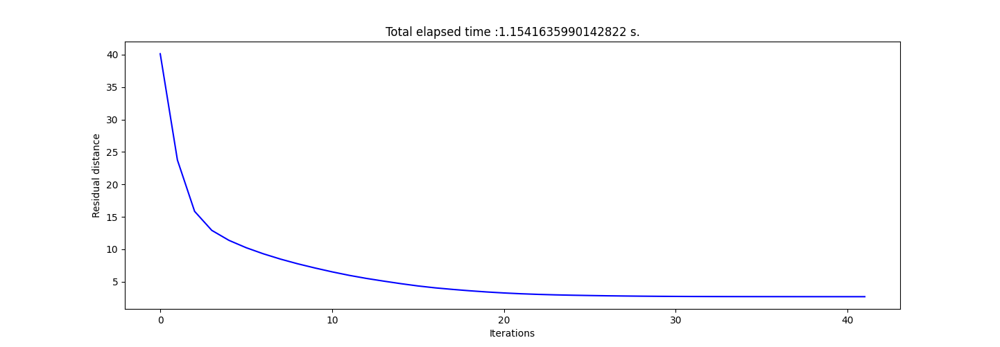

  

# 3D Vision Quality Control System

A practical implementation of 3D object quality control using RGB-D sensor data and point cloud processing techniques.

Subject in french: [Subject](https://clairelabitbonis.github.io/posts/teaching/3d_perception/practical_sessions_3d_perception/cc_segmentation/)
Subject in english: [Subject](README/Subject.pdf)

# Index
### - [What For?](#what-for)  
### - [How It Works](#how-it-works-in-simple-terms)  
### - [Project Files](#project-files-explained)  
### - [Real-World Applications](#real-world-applications)  
### - [Key Concepts](#key-concepts)

## What For?

Imagine you're manufacturing parts in a factory and need to check if each piece matches a perfect reference model. This system does exactly that - but in 3D! It uses depth cameras (like Microsoft Kinect) to capture 3D scans of objects and automatically detects defects like holes, bumps, or missing pieces.

## How It Works (In Simple Terms)

### 1. **Capturing 3D Data**
- An **RGB-D sensor** (a special camera that sees both color and depth) scans an object
- This creates a **point cloud** - imagine thousands of tiny dots in 3D space that together form the shape of the object
- Each point has X, Y, Z coordinates telling us exactly where it sits in space

| |Studied object|Reference Object|Wrong object|
|:-:|:-:|:-:|:-:|
|Point Cloud||||

### 2. **Building a Reference Model**
- First, we scan a perfect, flawless object to use as our "golden standard"
- We remove the background (table, walls, etc.) to isolate just the object
- This becomes our reference model that all future objects will be compared against

|Raw point cloud|Depth-colored point cloud|Segmented point cloud|
|-|-|-|
||||

### 3. **Aligning Test Objects (ICP Algorithm)**
- When we scan a new object to check, it might be rotated or positioned differently
- The **ICP (Iterative Closest Point)** algorithm is like a smart puzzle solver - it figures out how to rotate and move the test object so it perfectly aligns with the reference
- Think of it like overlaying two transparent sheets until they match as closely as possible

| |Comparison with Reference Object|Comparison with Wrong object|
|:-:|:-:|:-:|
|Residual distance graph|||
|ICP program results|||

### 4. **Detecting Defects**
- Once aligned, we compare the two point clouds
- Points that don't match up indicate defects:
  - **Extra points** = unwanted material or residues
  - **Missing points** = holes or missing pieces
  - **Displaced points** = deformations or incorrect dimensions

| |Comparison with Reference Object|Comparison with Wrong object|
|:-:|:-:|:-:|
|Dynamic comparison|||

## Project Files Explained

| File | What It Does |
|------|--------------|
| `datatools.py` | Helper functions to load, save, and visualize 3D point clouds |
| `icp.py` | The alignment algorithm that matches test objects to the reference |
| `qualitycheck.py` | Main script that runs the complete quality control process |
| `data01.xyz` | Raw scan of the reference scene (with background) |
| `data01_segmented.xyz` | Clean reference object (background removed) |
| `data02_object.xyz` | Test object #1 to check |
| `data03_object.xyz` | Test object #2 to check |

## Specific technologies used

- **CloudCompare** - Professional 3D point cloud viewing software

## Real-World Applications

- **Manufacturing quality control** - Check if parts match specifications
- **3D printing verification** - Ensure printed objects match the design
- **Archaeology** - Compare artifacts or restoration work
- **Medical imaging** - Detect anomalies in 3D scans
- **Robotics** - Help robots recognize and manipulate objects

## Understanding the Output

The system produces:
- **Visualizations** showing the reference (red) and test object (blue) overlaid
- **Error graphs** showing how well the alignment worked
- **Numerical measurements** of the differences between objects
- **Exported files** with the aligned point clouds for detailed inspection

## Key Concepts

### Point Cloud
A collection of points in 3D space that represents the surface of an object. Like a 3D connect-the-dots drawing with thousands of dots.

### Registration
The process of aligning two 3D scans so they're in the same coordinate system. Essential for comparison.

### RGB-D Sensor
A camera that captures both regular color images (RGB) and depth information (D), allowing it to see in 3D.

### ICP (Iterative Closest Point)
An algorithm that repeatedly:
1. Finds the closest points between two shapes
2. Calculates the best rotation and translation to align them
3. Applies the transformation and repeats until convergence

---

**Note:** This is an educational project designed to teach the fundamentals of 3D computer vision, point cloud processing, and automated quality control systems.
